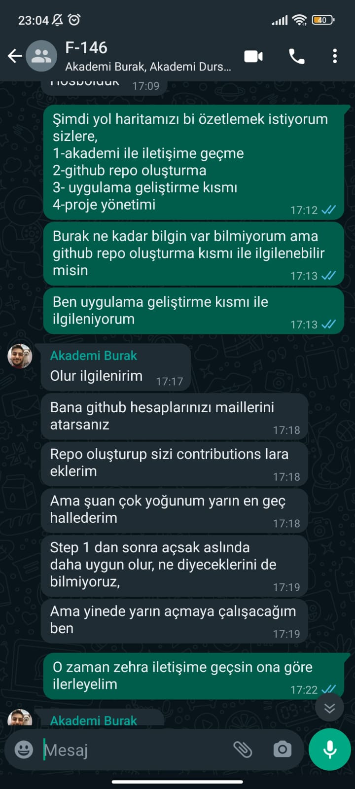
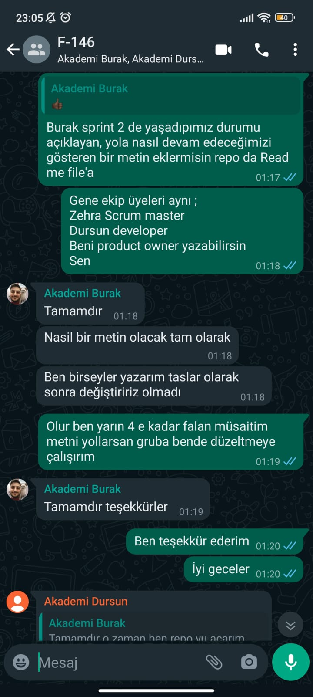
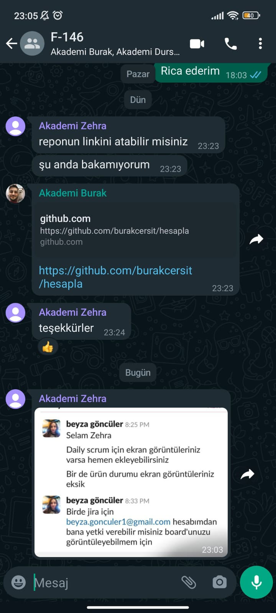
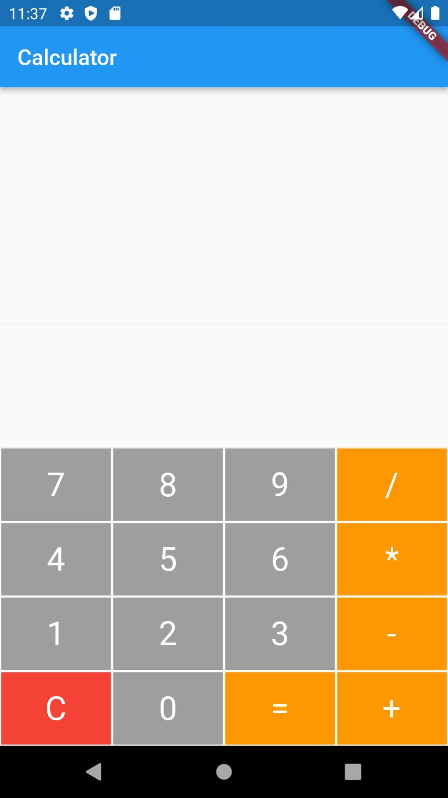

# Takım ismi

Flutter Anka (F*146)

# Ürün İle İlgili Bilgiler

## Takım Elemanları

Zehra Demırtaş: Scrum Master

Melike Tunç: Product Owner

Dursun Kurt: Developer

Burak Cerşit: Developer

## Ürün İsmi

--Hesapla--

## Ürün Açıklaması

Bu Uygulana ile, Flutter kullanarak geliştirdiğimiz basit bir hesap makinesi uygulamasını geliştireceğiz. Uygulama, kullanıcıların temel matematiksel işlemleri yapabilmelerini sağlar.

## Ürün Özellikleri

-Toplama, çıkarma, çarpma ve bölme gibi dört temel işlemi gerçekleştirme yeteneği

-Rakamlar, nokta ve işlem operatörleri için basit bir kullanıcı arayüzü

-İşlem geçmişi görüntüleme özelliği

## Hedef Kitle

- 15 - 65 yaş arası kullanıcılar
- Öğrenciler

## Product Backlog URL

[Miro Backlog Board](https://miro.com/)

# Sprint 2 - Yeniden Planlama

## Özet

Projemizin başlangıcında 5 kişilik bir ekip olarak birlikte çalışmaya başladık. Ancak Sprint 1'in sonunda bir grup üyemiz, projeden ayrılmaya karar verdi ve yapmış olduğumuz projeyi devralarak tek başına devam etme yolunu seçti. Bu nedenle, geriye kalan 4 grup üyesi olarak bir araya gelerek yeni bir proje üzerinde çalışmaya karar verdik. Bu durumu yönetmek ve projemizi yeniden planlamak için bir Sprint 1 toplantısı düzenledik.

## Yeniden Planlama Süreci

Yeni proje için önceliklerimizi ve hedeflerimizi belirlemek için bir beyin fırtınası yaptık. Yeniden planlama sürecinde aşağıdaki adımları izledik:

1. Yeni projenin gereksinimlerini ve özelliklerini gözden geçirdik ve öncelik sıralamasını belirledik.
2. Yeni proje için sprint hedeflerini ve takvimini belirledik.
3. Yeni görevleri ve sorumlulukları dağıttık ve takım üyelerine atadık.
4. Takım içi iletişimi ve işbirliğini artırmak için düzenli toplantılar ve güncellemeler planladık.

**Sprint Notları**: Sprint Notları Whatsapp üzerınden alınan kararlar JIRA üzerınden backlog olarak to do lıst e eklenır ve oradan sorumluluklar atanır ve takip edılır.

**Sprint içinde tamamlanması tahmin edilen puan**: 100 Puan
 
**Puan tamamlama mantığı**: Toplamda proje boyunca tamamlanması gereken 380 puanlık backlog bulunmaktadır. 4 sprint'e bölündüğünde ilk sprint'in en azından 100 ile başlaması gerektiğine karar verildi. 

**Backlog düzeni**: JIRA software management applıcation üzerınden görevler belirlenir ve sorumlulara atanır. Takibi ve kontrolü JIRA üzerınden yapılır.  

**Daily Scrum**: Daily Scrum toplantılarının zamansal sebeplerden ötürü Whatsapp üzerinden yapılmasına karar verilmiştir

 
 
 

**Sprint board update**: Sprint board Ulaşım linki: 
[JIRA](https://burakcersit.atlassian.net/jira/core/projects/HES/board?atlOrigin=eyJpIjoiMGMxYTIyM2Y4NTU1NDNhZGFkY2RjZjYzYjdlMDlkYTkiLCJwIjoiaiJ9)

**Sprint Review:** Ortak bir doğrultu sağlamak için uygulamanın hedefleri belirlendi, uygulama genel tasarımı, uygulamanın kodunun genel yapısı, sayfa geçişleri, splash sayfası ve firebase bağlantısı yapıldı. Proje yönetimi için gerekli araçlar, planlamalar yapıldı, uygulandı ve takip edilce. İlerdeki sprintler için yapılacaklar planlandı.

**Sprint Retrospective:**
-Takım içinde daha iyi koordinasyonun kurulması için iletişimin arttırılması gerektirilmesine karar verildi.
-Daha planlı hareket edilmesi gerektiğine karar verildi.
-Sprint sürelerine dikkat çekerek zamanın daha verimli kullanılmasına karar verildi.

**Sprint board update**: Sprint board screenshotları: 
 

## Screenshoot
 

# Sprint 3

---

